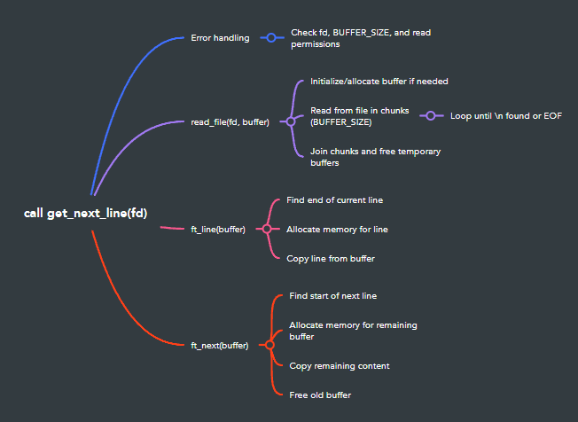

You will understand how files are opened, read and closed in an OS,
and how they are interpreted by a programming language for further analysis.
This task is crucial to understand for a future programmer since much of the time is based
on manipulating files for data management and persistence.
This project consists of coding a function that returns one line at a time from a text file.

[Check this readme on my blog !](https://cr0w.gitbook.io/j0xhn/42-school/get-next-line)

For more detailed information, look at the [**subject of this project**](https://github.com/jdecorte-be/42-Get-next-line/blob/master/en.subject.pdf).


## Static Buffer: Our Faithful Memory Keeper
In our get_next_line function, we use a static variable like this

```C
char *get_next_line(int fd)
{
    static char *buffer;
    // ... rest of the function
}
```
This ```buffer``` isn't just any ordinary variable. Oh no, it's got superpowers! Let's break down why it's so special:

1. **Persistent Memory**: Unlike regular variables that forget everything when the function ends, our static buffer remembers its contents between function calls. It's like having a notepad that doesn't get erased when you close the book!

2. **Picking Up Where We Left Off**: Thanks to this memory, we can continue reading from exactly where we stopped last time. No need to start from the beginning of the file each time get_next_line is called.

3. **Handling Partial Reads**: Sometimes, we might read more than one line into our buffer. The static variable allows us to keep that extra data for the next function call, ensuring we don't lose any information.

## How It Works in get_next_line
Let's walk through a typical lifecycle of our static buffer:

1. **First Call:**
   - We allocate memory for `buffer` and read from the file.
   - We extract the first line and return it.
   - Any leftover data stays in `buffer`.

2. **Subsequent Calls:**
   - `buffer` still contains the leftover data from last time.
   - We start by checking if there's a complete line in `buffer`.
   - If not, we read more from the file and append to `buffer`.
   - We extract the next line and update `buffer` again.

3. **Last Call:**
   - We've reached the end of the file.
   - We return any remaining data in `buffer`.
   - We free `buffer` and set it to NULL.

## Why Static is Perfect for This Job

- **Efficiency**: We don't need to re-read the entire file for each line. We just continue from where we left off.
- **Simplicity**: The static variable handles the state management for us. No need to pass around a pointer to keep track of our position.
- **Memory Management**: We can allocate memory once and reuse it, rather than allocating new memory for each function call.


## The Catch (Because There's Always One)

While our static buffer is awesome, it does come with a few quirks:

- ⚠️ **Multiple File Descriptors**: If you're reading from multiple files, you'll need to handle each file descriptor separately.
- ⚠️ **Memory Usage**: The buffer sticks around until the program ends, even if you're done reading the file.
- ⚠️ **Thread Safety**: If you're working in a multi-threaded environment, you'll need extra care to make this thread-safe.


## How that work?

### The Magic Behind the Scenes

1. **Buffer, Our Old Friend**: Just like in our buffer overflow example, `get_next_line` uses a buffer. But don't worry, it's not trying to overflow anything! This buffer is more like a temporary storage space.
2. **Reading Chunks**: Instead of reading the whole file at once, it reads chunks into the buffer. Think of it like taking bites of a sandwich instead of shoving the whole thing in your mouth.
3. **Searching for the Newline**: After each read, it looks for the `\n` character. It's like playing "Where's Waldo?", but Waldo is a newline, and the crowd is our buffer full of characters.
4. **Returning the Line**: When it finds a newline (or reaches the end of the file), it says "Aha! Here's a complete line!" and returns it to you.
5. **Remembering Where It Left Off**: Here's where it gets clever. It remembers where it stopped, so the next time you call it, it starts from there. It's like using a bookmark in a really long book.


### In Action

Imagine you're reading this buffer overflow article line by line using `get_next_line`. It would go something like this:

1. First call: "Hello "
2. Second call: "My name "
3. Third call: "is John!"

...and so on, until it reaches the end of the file.


## Wrapping Up

So there you have it! `get_next_line` is like a diligent reader with a really good memory. It reads bit by bit, always remembers where it left off, and hands you neat, tidy lines of text whenever you ask.

Just like how we carefully examined each part of the buffer overflow process, `get_next_line` carefully manages its reading process to give you exactly what you need, when you need it. Cool, right?

---

### (Spoiler) My code!

⚠️ **Try to do it on your own and only consult the solutions in case of ultimate trouble! And if you want to look at the answers, try to understand what you are doing ;)**


## Detailed Function Overview

### The Main Function: `get_next_line`

This is the heart of the solution. It reads a line from the file descriptor, updates the buffer, and returns the line.

```c
char *get_next_line(int fd)
{
    static char *buffer;
    char *line;

    if (fd < 0 || BUFFER_SIZE <= 0 || read(fd, 0, 0) < 0)
        return (NULL);
    buffer = read_file(fd, buffer);
    if (!buffer)
        return (NULL);
    line = ft_line(buffer);
    buffer = ft_next(buffer);
    return (line);
}
```

- **Parameters**: File descriptor `fd`.
- **Returns**: The next line, or `NULL` on error or when the file ends.
  
The function works as follows:

1. **Error Handling**: If the file descriptor is invalid, or if there's an issue with `BUFFER_SIZE` or the read call, it returns `NULL`.
2. **Reading the File**: It calls the `read_file` function to read data into the static `buffer`.
3. **Line Extraction**: Using `ft_line`, it extracts the next line from the buffer.
4. **Buffer Update**: The remaining data in the buffer is adjusted by `ft_next` to account for the extracted line.
5. **Return**: Finally, it returns the extracted line.

---

### Reading from the File: `read_file`

The `read_file` function reads from the file into the buffer in chunks, appending data to a result string until a newline or the end of the file is encountered.

```c
char *read_file(int fd, char *res)
{
    char *buffer;
    int byte_read;

    if (!res)
        res = ft_calloc(1, 1);
    buffer = ft_calloc(BUFFER_SIZE + 1, sizeof(char));
    byte_read = 1;
    while (byte_read > 0)
    {
        byte_read = read(fd, buffer, BUFFER_SIZE);
        if (byte_read == -1)
        {
            free(buffer);
            return (NULL);
        }
        buffer[byte_read] = 0;
        res = ft_free(res, buffer);
        if (ft_strchr(buffer, '\n'))
            break;
    }
    free(buffer);
    return (res);
}
```

- **Parameters**: The file descriptor `fd` and the current `res` buffer.
- **Returns**: The updated buffer with data read from the file.

This function works as follows:

1. **Initialization**: If the buffer (`res`) is `NULL`, it is initialized with a single byte using `ft_calloc`.
2. **Reading Loop**: It allocates space for a temporary `buffer` of size `BUFFER_SIZE` and reads data from the file into this buffer.
3. **Byte Read Check**: If `byte_read` is -1, indicating an error during reading, it frees the buffer and returns `NULL`.
4. **Appending Data**: It appends the newly read data to the result (`res`) using `ft_free`, which joins the strings.
5. **Newline Detection**: The loop breaks as soon as a newline character is found in the buffer.
6. **Return**: The updated result string (`res`) is returned after freeing the temporary buffer.

---

### Extracting a Line: `ft_line`

This function extracts a single line from the buffer, ensuring it stops at the newline character.

```c
char *ft_line(char *buffer)
{
    char *line;
    int i = 0;

    if (!buffer[i])
        return (NULL);
    while (buffer[i] && buffer[i] != '\n')
        i++;
    line = ft_calloc(i + 2, sizeof(char));
    i = 0;
    while (buffer[i] && buffer[i] != '\n')
    {
        line[i] = buffer[i];
        i++;
    }
    if (buffer[i] && buffer[i] == '\n')
        line[i++] = '\n';
    return (line);
}
```

- **Parameters**: The buffer containing the file data.
- **Returns**: The extracted line.

How it works:

1. **Empty Check**: If the buffer is empty, it returns `NULL`.
2. **Line Length**: It calculates the length of the line by counting characters until it finds a newline (`\n`) or reaches the end of the buffer.
3. **Memory Allocation**: It allocates memory for the line, using the length calculated earlier.
4. **Copying Data**: It copies characters from the buffer into the new line until the newline or the end of the buffer is reached.
5. **Newline Inclusion**: If a newline character is found, it includes it in the extracted line.
6. **Return**: The newly created line is returned.

---

### Updating the Buffer: `ft_next`

After a line is extracted, `ft_next` updates the buffer by removing the line we just read, keeping any remaining data for future calls to `get_next_line`.

```c
char *ft_next(char *buffer)
{
    int i = 0, j = 0;
    char *line;

    while (buffer[i] && buffer[i] != '\n')
        i++;
    if (!buffer[i])
    {
        free(buffer);
        return (NULL);
    }
    line = ft_calloc((ft_strlen(buffer) - i + 1), sizeof(char));
    i++;
    while (buffer[i])
        line[j++] = buffer[i++];
    free(buffer);
    return (line);
}
```

- **Parameters**: The buffer containing the data after reading.
- **Returns**: The updated buffer, or `NULL` if there’s no remaining data.

How it works:

1. **Finding the End of the Line**: It scans the buffer to locate the end of the first line (identified by the newline character).
2. **Buffer Exhausted**: If there is no remaining data in the buffer, it frees the buffer and returns `NULL`.
3. **Memory Allocation**: If there is remaining data, it allocates space for a new buffer that will hold the leftover data.
4. **Shifting Data**: It copies the remaining data (after the newline) to the new buffer.
5. **Freeing Old Buffer**: The old buffer is freed, and the new one is returned.

---

### Helper Function: `ft_free`

This function joins two strings and frees the first one. It is useful for memory management when appending data to the buffer during file reads.

```c
char *ft_free(char *buffer, char *buf)
{
    char *temp;

    temp = ft_strjoin(buffer, buf);
    free(buffer);
    return (temp);
}
```

- **Parameters**: Two strings: `buffer` (which will be freed) and `buf` (to be joined).
- **Returns**: A new string that is the result of joining the two input strings.

How it works:

1. **Joining Strings**: It uses the `ft_strjoin` function to concatenate `buffer` and `buf`.
2. **Freeing Memory**: After joining the strings, it frees the memory allocated to `buffer` to avoid memory leaks.
3. **Return**: It returns the newly created string.

## Code Flow Chart


And there you have it! That's how this implementation of `get_next_line` works. It's a clever use of static variables, dynamic memory allocation, and string manipulation to solve the problem of reading a file line by line.
Remember, the key challenges here are handling partial reads, dealing with lines of unknown length, and managing memory efficiently. This solution tackles all of these issues head-on!

Happy coding, and may your lines always be well-read! 😉


## Resources

- https://www.codequoi.com/en/local-global-static-variables-in-c/
- https://www.educative.io/answers/how-to-read-data-from-a-file-using-the-fread-function-in-c
- https://youtu.be/xgDSXNOHTIA?si=VgVe1Md7aZ_vUmEp
- https://github.com/Tripouille/gnlTester
- https://github.com/kodpe/gnl-station-tester